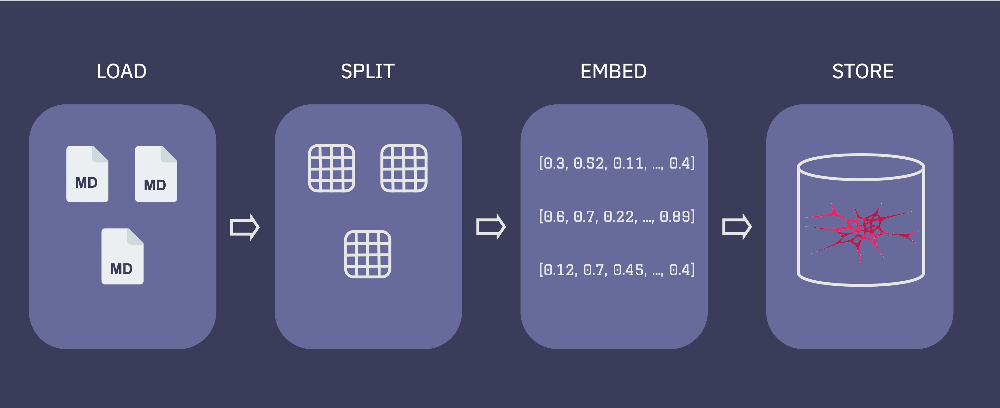
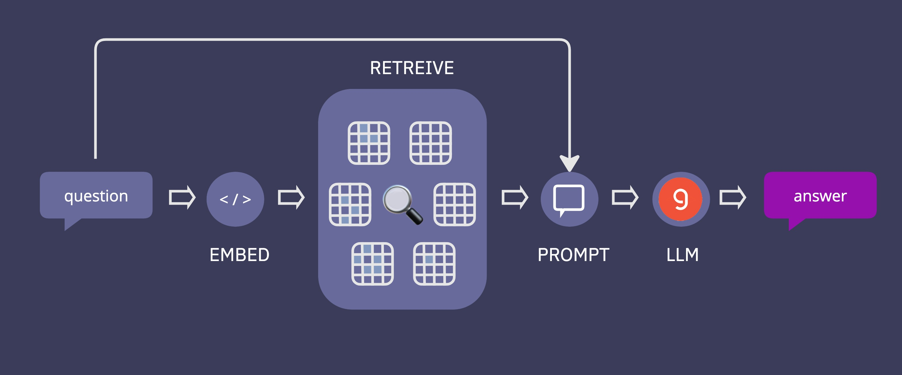

# HypnoQ

**HypnoQ** is a Q&A chatbot designed to educate potential clients about cognitive hypnotherapy. It uses **Retrieval-Augmented Generation (RAG)** and a **Large Language Model (LLM)** to provide accurate, tailored information, addressing common misconceptions and alleviating concerns about hypnotherapy.  

The chatbot offers an anonymous, non-intimidating way for users to learn about cognitive hypnotherapy before deciding to engage with a human therapist.  

The chatbot is designed to be integrated into a cognitive hypnotherapist’s website, offering accurate and specific responses that align with the unique aspects of cognitive hypnotherapy rather than general hypnotherapy, ensuring that users receive reliable, relevant information.  

## Features

- **Interactive Q&A**: Engage with the chatbot to ask any questions related to hypnotherapy.
- **Comprehensive Knowledge Base**: Access a wide range of information on hypnotherapy, including its benefits, common techniques, and usage scenarios.
- **User-Friendly Interface**: HypnoQ offers a simple and intuitive chat interface for seamless interaction.
- **Real-Time Responses**: Receive instant answers to your questions, powered by advanced NLP models.
- **Tailored Insights**: Get personalized responses based on the context of your queries.

### Project RAG Flow

**Indexing** 
1. Load: loading the q&a markdown file.
2. Split: Text splitters break large Documents into smaller chunks. In rhis project the questions and answers where in a good size so using `MarkdownHeaderTextSplitter` splitting on Header 4 was suffiecent.
3. Store: FAISS VectorStore and Embeddings model were used to index and store the splits.


**Retrieval and generation** 
4. Retrieve: Given a potential client question, relevant splits are retrieved from storage using a Retriever.
5. Generate: Groq with mixtral-8x7b-32768 produces an answer using a prompt that includes the question and the retrieved data

### Dataset

The dataset used in this project is a makedown file contains past clients common asked questions and therapist answers. 

You can find the data in `data/markdown_files`


### 🛠️ Technology Stack 

Hypnoq is built using the following technologies:

**Backend** Python, FastAPI
**LLM:** Langchain, Groq, mixtral-8x7b-32768
**Vector Database:** FAISS
**Frontend:** Streamlit
**Dashboard:** Grafana
**Analytics Database:** PostgreSQL
**Deployment**: Docker, Docker Compose

## 🚀 Getting Started
### Prerequisites
- Python 3.12
- API key for [Groq](https://groq.com/)
- Docker 

###  Setup Guide

To run Hypnoq locally, follow these steps:

1. **Clone the repository**
   ```sh
   git clone https://github.com/Moris0n/HypnoQ.git
   cd HypnoQ
   ```


2. **Create a `.env` file**
   Create a file named `.env` in the root directory of the project with the following content:
   ```
   POSTGRES_HOST=postgres
   POSTGRES_USER=your_username
   POSTGRES_PASSWORD=your_password
   POSTGRES_DB=hypno_analytics

   DATA_PATH=/app/data
   INDEX_NAME=/app/hypnoq_index

   GROQ_API_KEY=your_api_key
   EMBEDDING_MODEL=BAAI/bge-base-en-v1.5
   LLM_MODEL=mixtral-8x7b-32768
      
   APP_PORT=5000
   TZ=Europe/Berlin

   GRAFANA_ADMIN_USER=admin
   GRAFANA_ADMIN_PASSWORD=admin
   GRAFANA_SECRET_KEY=SECRET_KEY
   ```
   **Note**: Replace `apikey` with your actual Groq API key.  
    
3. **Run Docker Compose**
   Execute the following command in the terminal:

   ```bash
   docker-compose -f docker-compose.override.yml up --build
   ```

   running again 
    
   ```bash
   docker-compose -f docker-compose.override.yml up
   ```  
   once the docker is running you can interact with the chatbot  `http:localhost-8501`  

   Note : this project has two docker-compose file, one was used for deployment and one for running localy.  

4. **Access the Application**
   Once the Docker containers are up and running, you can access the Hypnoq application at:

   ```
   http://localhost:8501
   ```
Important: Ensure you have Docker and Docker Compose installed on your system before running these commands.
   
###  Deployed Version  

A deployed version of Hypnoq is available for public access. This version utilizes cloud services for enhanced performance and scalability:

- Markdown files for RAG are stored in Google Cloud Bucket
- Vector database is deployed as a Google Cloud job
- Backend models are deployed on Google Cloud Run
- Frontend is hosted on Streamlit Community

You can access the deployed version of Hypnoq at:
https://hypnoq-q.streamlit.app/  

This deployed version allows you to try out Hypnoq without the need for local setup.

## Project Structure

```
.
├── data/
│   └── markdown_files/        # Knowledge base documents
├── vector_db/
│   ├── src/
│   │   └── ingest_documents.py    # Document loading and vector index creation
│   └── Dockerfile
├── models/
│   ├── src/
│   │   ├── chains/
│   │   │   ├── hypnoq_chain.py    # LangChain prompts for RAG
│   │   │   └── rag.py             # Answer structuring and evaluation
│   │   ├── analytics/
│   │   │   └── db.py              # Analytics data update for Postgres
│   │   └── main.py                # FastAPI backend
│   └── Dockerfile
├── frontend/
│   ├── src/
│   │   └── main.py                # Streamlit app
│   └── Dockerfile
├── evaluation/                # RAG and retrieval evaluation notebooks
├── docker-compose.override.yml    # Local development compose file
└── docker-compose.yml             # Production deployment compose file
```

## Components

### 1. Knowledge Base
- Location: `data/markdown_files/`
- Contains the document corpus used as the knowledge base for the RAG system.

### 2. Vector Database
- Location: `vector_db/`
- `ingest_documents.py`: Loads markdown files and creates a vector index for efficient retrieval.
- Has its own Dockerfile for containerization.

### 3. Model Backend
- Location: `models/`
- `chains/hypnoq_chain.py`: Contains LangChain prompts for accessing the vector index and creating RAG prompts for the Groq LLM.
- `chains/rag.py`: Structures data received from the LLM and evaluates the answers.
- `analytics/db.py`: Updates PostgreSQL with analytical data (token count, retrieval time, user/LLM feedback) for dashboard creation.
- `main.py`: Defines the FastAPI backend for accessing the models.
- Has its own Dockerfile for containerization.

### 4. Frontend
- Location: `frontend/`
- `main.py`: Implements a Streamlit app for user interaction.
- Has its own Dockerfile for containerization.

### 5. Evaluation
- Location: `evaluation/`
- Contains Jupyter notebooks for evaluating the RAG system and retrieval performance.

### 6. Deployment
- `docker-compose.override.yml`: Used for local development.
- `docker-compose.yml`: Used for creating images for production deployment.


### Retrieval Evaluation

For retrieval evaluation, a ground truth dataset was generated by creating variations of the original questions stored in the vector database. Using an LLM, five different questions were crafted for each existing question-answer pair, forming a new CSV file. This approach ensured a broad testing base to evaluate the effectiveness of retrieval.

The FAISS vector database was then evaluated on this new dataset by running retrieval queries on the newly created questions. The performance of the retrieval system was measured using two key metrics:
- **Hit Rate**: 0.95
- **MRR (Mean Reciprocal Rank)**: 0.764

The evaluation process was executed in the notebook `evaluation/evaluate_retrival.ipynb`, and the results show that the retrieval system consistently returned relevant results for the provided queries.

### RAG Evaluation

The RAG evaluation focused on assessing how well the generated responses matched the original answers in the vector database. For each question in the vector DB, both the original reference answer and the chatbot’s LLM-generated answer (using the RAG flow) were compared.

Two methods were used for evaluation:
1. **Cosine Similarity**: The cosine similarity between the original and generated answers was computed, yielding a mean of **0.8425**, indicating a high level of similarity between the responses.
2. **LLM-Based Judgments**: A secondary LLM was used to judge the relevance of the answers. Out of 17 responses, 12 were labeled as "RELEVANT," and 5 were labeled as "PARTLY RELEVANT."


## License

This project is licensed under the MIT License. See the `LICENSE` file for more details.
