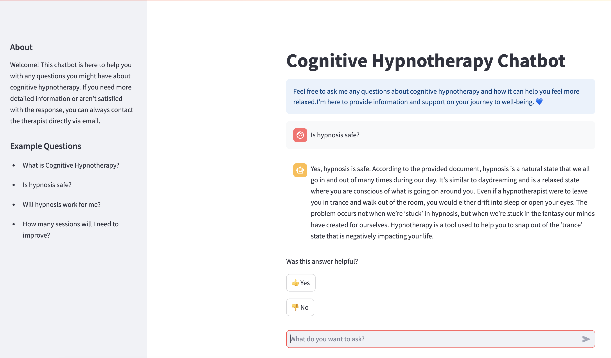
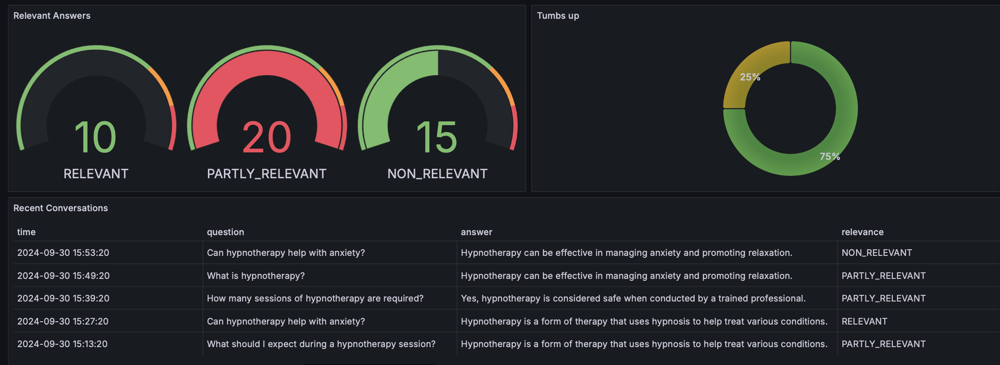
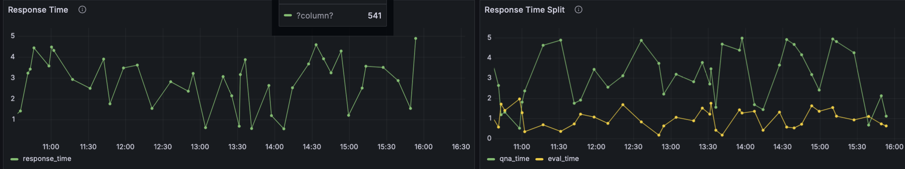
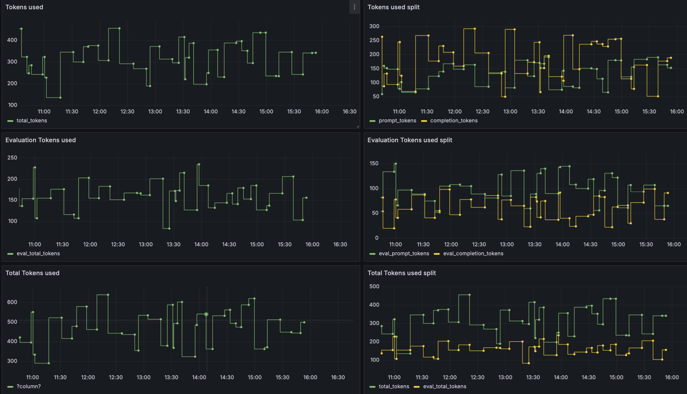

# HypnoQ

**HypnoQ** is a Q&A chatbot designed to educate potential clients about cognitive hypnotherapy. It uses **Retrieval-Augmented Generation (RAG)** and a **Large Language Model (LLM)** to provide accurate, tailored information, addressing common misconceptions and alleviating concerns about hypnotherapy.  

The chatbot offers an anonymous, non-intimidating way for users to learn about cognitive hypnotherapy before deciding to engage with a human therapist.  

The chatbot is designed to be integrated into a cognitive hypnotherapist’s website, offering accurate and specific responses that align with the unique aspects of cognitive hypnotherapy rather than general hypnotherapy, ensuring that users receive reliable, relevant information. 



## Features

- **Interactive Q&A**: Engage with the chatbot to ask any questions related to hypnotherapy.
- **Comprehensive Knowledge Base**: Access a wide range of information on hypnotherapy, including its benefits, common techniques, and usage scenarios.
- **User-Friendly Interface**: HypnoQ offers a simple and intuitive chat interface for seamless interaction.
- **Real-Time Responses**: Receive instant answers to your questions, powered by advanced NLP models.
- **Tailored Insights**: Get personalized responses based on the context of your queries.

### Project RAG Flow

**Indexing** 
1. Load: loading the q&a markdown file.
2. Split: Text splitters break large Documents into smaller chunks. In rhis project the questions and answers where in a good size so using `MarkdownHeaderTextSplitter` splitting on Header 4 was suffiecent.
3. Store: FAISS VectorStore and Embeddings model were used to index and store the splits.


**Retrieval and generation** 
4. Retrieve: Given a potential client question, relevant splits are retrieved from storage using a Retriever.
5. Generate: Groq with mixtral-8x7b-32768 produces an answer using a prompt that includes the question and the retrieved data

### Dataset

The dataset used in this project is a makedown file contains past clients common asked questions and therapist answers. 

You can find the data in `data/markdown_files`


### 🛠️ Technology Stack 

Hypnoq is built using the following technologies:

**Backend** Python, FastAPI
**LLM:** Langchain, Groq, mixtral-8x7b-32768
**Vector Database:** FAISS
**Frontend:** Streamlit
**Dashboard:** Grafana
**Analytics Database:** PostgreSQL
**Deployment**: Docker, Docker Compose

## 🚀 Getting Started
### Prerequisites
- Python 3.12
- API key for [Groq](https://groq.com/)
- Docker 

###  Setup Guide

To run Hypnoq locally, follow these steps:

1. **Clone the repository**
   ```sh
   git clone https://github.com/Moris0n/HypnoQ.git
   cd HypnoQ
   ```


2. **Create a `.env` file**
   Create a file named `.env` in the root directory of the project with the following content:
   ```
   POSTGRES_HOST=postgres
   POSTGRES_USER=your_username
   POSTGRES_PASSWORD=your_password
   POSTGRES_DB=hypno_analytics

   DATA_PATH=/app/data
   INDEX_NAME=/app/hypnoq_index

   GROQ_API_KEY=your_api_key
   EMBEDDING_MODEL=BAAI/bge-base-en-v1.5
   LLM_MODEL=mixtral-8x7b-32768
      
   APP_PORT=5000
   TZ=Europe/Berlin

   GRAFANA_ADMIN_USER=admin
   GRAFANA_ADMIN_PASSWORD=admin
   GRAFANA_SECRET_KEY=SECRET_KEY
   ```
   **Note**: Replace `apikey` with your actual Groq API key.  
    
3. **Run Docker Compose**
   Execute the following command in the terminal:

   ```bash
   docker-compose -f docker-compose.override.yml up --build
   ```

   running again 
    
   ```bash
   docker-compose -f docker-compose.override.yml up
   ```  
   once the docker is running you can interact with the chatbot  `http:localhost-8501`  

   Note : this project has two docker-compose file, one was used for deployment and one for running localy.  

4. **Access the Application**
   Once the Docker containers are up and running, you can access the Hypnoq application at:

   ```
   http://localhost:8501
   ```
Important: Ensure you have Docker and Docker Compose installed on your system before running these commands.
   
###  Deployed Version  

A deployed version of Hypnoq is available for public access. This version utilizes cloud services for enhanced performance and scalability:

- Markdown files for RAG are stored in Google Cloud Bucket
- Vector database is deployed as a Google Cloud job
- Backend models are deployed on Google Cloud Run
- Frontend is hosted on Streamlit Community

You can access the deployed version of Hypnoq at:
https://hypnoq-q.streamlit.app/  

This deployed version allows you to try out Hypnoq without the need for local setup.

## Project Structure

```
.
├── data/
│   └── markdown_files/        # Knowledge base documents
├── vector_db/
│   ├── src/
│   │   └── ingest_documents.py    # Document loading and vector index creation
│   └── Dockerfile
├── models/
│   ├── src/
│   │   ├── chains/
│   │   │   ├── hypnoq_chain.py    # LangChain prompts for RAG
│   │   │   └── rag.py             # Answer structuring and evaluation
│   │   ├── analytics/
│   │   │   └── db.py              # Analytics data update for Postgres
│   │   └── main.py                # FastAPI backend
│   └── Dockerfile
├── frontend/
│   ├── src/
│   │   └── main.py                # Streamlit app
│   └── Dockerfile
├── evaluation/                # RAG and retrieval evaluation notebooks
├── docker-compose.override.yml    # Local development compose file
└── docker-compose.yml             # Production deployment compose file
```

## Components

### 1. Knowledge Base
- Location: `data/markdown_files/`
- Contains the document corpus used as the knowledge base for the RAG system.

### 2. Vector Database
- Location: `vector_db/`
- `ingest_documents.py`: Loads markdown files and creates a vector index for efficient retrieval.
- Has its own Dockerfile for containerization.

### 3. Model Backend
- Location: `models/`
- `chains/hypnoq_chain.py`: Contains LangChain prompts for accessing the vector index and creating RAG prompts for the Groq LLM.
- `chains/rag.py`: Structures data received from the LLM and evaluates the answers.
- `analytics/db.py`: Updates PostgreSQL with analytical data (token count, retrieval time, user/LLM feedback) for dashboard creation.
- `main.py`: Defines the FastAPI backend for accessing the models.
- Has its own Dockerfile for containerization.

### 4. Frontend
- Location: `frontend/`
- `main.py`: Implements a Streamlit app for user interaction.
- Has its own Dockerfile for containerization.

### 5. Evaluation
- Location: `evaluation/`
- Contains Jupyter notebooks for evaluating the RAG system and retrieval performance.
- Detailed explabation can be found in [`evaluation/README.md`](evaluation/README.md).

### 6. Deployment
- `docker-compose.override.yml`: Used for local development.
- `docker-compose.yml`: Used for creating images for production deployment.

## Monitoring

Grafana is used for monitoring the application. 

It's accessible at [localhost:3000](http://localhost:3000):

- Login: "admin"
- Password: "admin"

### Dashboards

The monitoring dashboard contains several panels:  

 

1. **Relevant Answer (Gauge Chart):** This chart visualizes the relevance of responses during conversations. It uses color-coded thresholds to represent different levels of response quality, allowing for a quick assessment of how relevant the answers are.

2. **User Feedback (Pie Chart):** A pie chart displaying user feedback, breaking down the number of positive (thumbs up) and negative (thumbs down) responses. This panel provides insights into overall user satisfaction.

3. **Recent Conversations (Table):** A table listing the five most recent questions, including details like the question, answer, relevance score, and timestamp. This panel helps track and review the latest user interactions.  



1. **Response Time (Time Series):** A time series chart that tracks the response times of conversations over a given period. This panel is valuable for identifying performance bottlenecks and ensuring the system maintains quick response times.

2. **Response Time Breakdown (Time Series):** This chart splits the overall response time into two components: the time taken by the LLM to generate an answer and the time it takes to evaluate the response. It displays a time series of each, providing deeper insights into system performance.  



1. **Tokens Used (Time Series):** A time series chart that monitors the number of tokens consumed during conversations over time. This helps analyze usage patterns and the amount of data being processed.

2. **Token Breakdown (Time Series):** This chart separates token usage into two categories: prompt tokens and completion tokens. It provides a time series view of each, offering insights into how tokens are distributed between input and output during conversations.  

3. **Evaluation Tokens (Time Series):** A time series chart tracking the number of tokens used during the evaluation phase of conversations over time. This helps in understanding the token consumption related to the model's evaluation process.

4. **Evaluation Token Breakdown (Time Series):** This chart separates evaluation token usage into two parts: tokens used for the prompt during evaluation and tokens generated for the completion. It provides a time series view of each, allowing for detailed analysis of token distribution during the evaluation phase.

5. **Total Tokens (Time Series):** A time series chart showing the total number of tokens used across all conversations over time, providing an overview of token consumption.

6. **Total Token Breakdown (Time Series):** This chart splits the total tokens into prompt and completion tokens, offering a quick comparison of their usage over time.
Here’s how you can explain the manual setup process in your README file:

### Manual Setup for Grafana and Postgres

#### 1. Add the Postgres Datasource to Grafana
1. Open your Grafana instance in a web browser (default: `http://localhost:3000`).
2. Log in with the default credentials (Username: `admin`, Password: `admin`, unless you’ve changed it).
3. Navigate to **Configuration** > **Data Sources** from the left-hand menu.
4. Click **Add data source**, select **PostgreSQL**.
5. Fill in the following fields:
   - **Host**: `postgres:5432` or just `postgres`
   - **Database**: `hypno_analytics`
   - **User**: `mor` or your username (in case you changed it)
   - **Password**: Use the Postgres password defined in your environment variables or Docker Compose file.
   - Leave the other settings as default (e.g., SSL mode: `disable`).
6. Click **Save & Test** to verify the connection.

#### 2. Run the `generate_data.py` Script in the Postgres Docker Container
This step generates the analytics data required by your Grafana dashboard.

1. Open a terminal and run the following command to access the Postgres Docker container:
   ```bash
   docker-compose exec postgres bash
   ```
2. Once inside the container, navigate to the directory containing the script:
   ```bash
   cd /path/to/models/src/analytics
   ```
   (Make sure this path is correctly mapped in your Docker setup.)
3. Run the script:
   ```bash
   python generate_data.py
   ```
   This script will populate the Postgres database with the required analytics data.

#### 3. Load the Dashboard into Grafana
1. In Grafana, navigate to **Dashboards** > **Manage** from the left-hand menu.
2. Click **Import**.
3. Click **Upload JSON file** and select the file `grafana/provisioning/dashboards/ChatBot Dashboard-1727707805906.json`.
4. Choose the appropriate data source (your Postgres datasource) when prompted.
5. Click **Import** to load the dashboard.

Your Grafana dashboard should now be ready to display data.

## License

This project is licensed under the MIT License. See the `LICENSE` file for more details.
